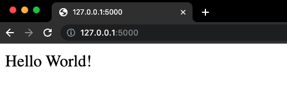
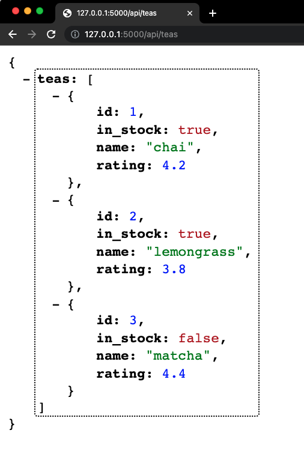
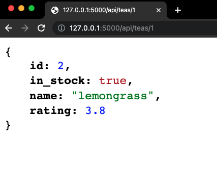
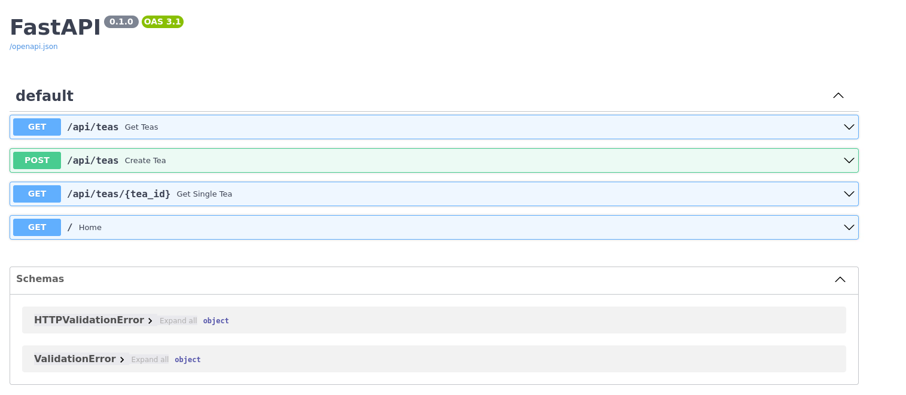
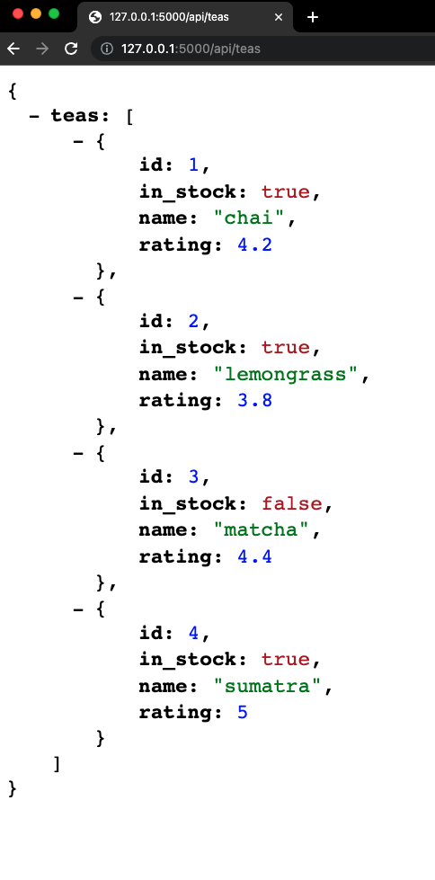

 
# FastAPI CRUD App

**You're going to build your first FastAPI CRUD app!**

You've been provided a folder for your FastAPI App: ./exercises/fast_api_crud_app

```bash
cd ./exercises/fast_api_crud_app
pipenv install fastapi uvicorn
```

<details>

<summary> What does <code>pipenv install fastapi uvicorn</code> command do? </summary>

This command will automatically create a `Pipfile` and a `Pipfile.lock`, setting up a virtual environment for us (refer to the [pipenv readme](../03-fast-api-intro/pipenv.md) in Lesson 3 for more details). Using `pipenv` to install your packages ensures that you can collaborate on projects just like in Node; simply clone or download the repo and type `pipenv install` to install all the dependencies.

</details>

### Steps

1.  `touch main.py`

1. Open `main.py` in your editor and add the following:

```py
""" main.py """
from fastapi import FastAPI
app = FastAPI()

@app.get('/')
def home():
    """ Hello world function """
    return 'Hello World!'

```

1. Run the app: `pipenv run uvicorn main:app --reload`

1. Browse to `http://127.0.0.1:8000`



Make sure you see the `Hello World!` message before proceeding.

## Create the Controller and Model files

1. Leave your application running, and open up another terminal to work in. 
1. `cd ./exercises/fast_api_crud_app`
1. `mkdir models controllers`
1. `touch models/tea_data.py controllers/teas.py`

### Model

Remember from our [MVC discussion](./MVC.md) that the model manages the application's data.

To start with, we'll create some mock data to simulate what we would store in a database. We'll put this data in the `models/tea_data.py` file. Open that file in your editor and add the following:

```py
""" tea_data.py """
teas_db = {
    "teas": [
        {"id": 1, "name": "chai", "in_stock": True, "rating": 4.2},
        {"id": 2, "name": "lemongrass", "in_stock": True, "rating": 3.8},
        {"id": 3, "name": "matcha", "in_stock": False, "rating": 4.4},
    ]
}

```

### Controller

Open `controllers/teas.py` in your editor and add the following:

```py
"""teas.py"""
from fastapi import APIRouter
from models.tea_data import teas_db

router = APIRouter()

@router.get("/teas")
def get_teas():
    """ Get all teas """
    return teas_db

```

## Putting it all together

Now edit `main.py` and modify it to look like the following:

```py
""" main.py """
from fastapi import FastAPI
from controllers.teas import router as TeasRouter

app = FastAPI()

app.include_router(TeasRouter, prefix="/api")

@app.get('/')
def home():
    """ Hello world function """
    return 'Hello World!'

```

We added a line to include the `TeasRouter` from `controllers/teas.py`. This line specifies the prefix `/api`, so when we call an API method, we must prefix it with `/api` in the URL.

In your browser, navigate to `http://127.0.0.1:8000/api/teas`. This will invoke the `teas` GET method from `controllers/teas.py`. You should see the data from the model, like so:



## Adding additional API methods

So far we have an API GET method for the root (`/`) which displays the "Hello World!" message. We also have an API GET method for getting all of the teas data in the `teas_db` object.

Now we need to add a method to get the data for just one tea. 

### GET a single tea

Update `controllers/teas.py` to reflect the following:

```py
"""teas.py"""
from fastapi import APIRouter, HTTPException
from models.tea_data import teas_db

router = APIRouter()

@router.get("/teas")
def get_teas():
    """ Get all teas """
    return teas_db

@router.get("/teas/{tea_id}")
def get_single_tea(tea_id: int):
    """ Get single tea by ID """
    for tea in teas_db['teas']:
        if tea['id'] == tea_id:
            return tea
    raise HTTPException(status_code=404, detail="Tea not found")

```

Notice that the new endpoint expects a `tea_id` integer. If you look at the `teas_db` list object, the list of teas is as follows:

```py
teas_db = {
    "teas": [
        {"id": 1, "name": "chai", "in_stock": True, "rating": 4.2},
        {"id": 2, "name": "lemongrass", "in_stock": True, "rating": 3.8},
        {"id": 3, "name": "matcha", "in_stock": False, "rating": 4.4},
    ]
}
```

For each tea, it compares the id of the tea to the provided tea_id.

**Return Matching Tea:** If a tea with the matching id is found, the function returns that tea.

**Handle Not Found:** If no matching tea is found after iterating through the list, the function raises an HTTPException with a 404 status code to indicate that the tea was not found.

Navigate to `http://127.0.0.1:8000/api/teas/2`. You should see this:



### Create `POST` method to create teas

Now we want to add the ability to create new teas. Recall that the HTTP POST method is typically used to create a record, so that's what we'll implement here.

Update `controllers/teas.py` to reflect the following:

```py
"""teas.py"""
from fastapi import APIRouter
from fastapi import HTTPException
from models.tea_data import teas_db

router = APIRouter()

@router.get("/teas")
def get_teas():
    """ Get all teas """
    return teas_db

@router.get("/teas/{tea_id}")
def get_single_tea(tea_id: int):
    """ Get single tea by ID """
    if tea_id > len(teas_db["teas"]) or tea_id < 1:
        raise HTTPException(status_code=404, detail="Item not found")
    return teas_db['teas'][tea_id - 1]  # -1 because list indexes start at 0

@router.post("/teas") # New POST method to create new teas
def create_tea(tea: dict):
    """ Create tea """
    teas_db["teas"].append(tea)
    return tea

```

When you simply browse to a URL in your browser, you're using the HTTP GET action. But to update our teas, we have to do a POST action. How can we do this? FastAPI automatically generates interactive API documentation that you can use to POST data to a URL. Navigate to `http://127.0.0.1:8000/docs` to see it.



Click on the `POST /api/teas`, then click the *Try it out* button. 

Try creating a new tea by pasting the following JSON data in the Request body:

```json

	{
		"id": 4,
		"name": "sumatra",
		"in_stock": true,
		"rating": 5
	}

```

Click the *Execute* button. You should get a 200 response code, indicating success.

After the post, check `http://127.0.0.1:8000/api/teas`



### Complete The App

Complete the `fast_api_crud_app` CRUD functionality by adding the UPDATE and DELETE routes in the `teas.py` controller file.

UPDATE should update a single existing tea. DELETE should delete a single existing tea.

Don't forget to shut down your app once you're done.
